# Real-Time Crypto Streaming Pipeline

An end-to-end real-time data pipeline for cryptocurrency market data, covering the full data engineering stack — ingestion, stream processing, storage, orchestration, warehousing, visualization, and observability.

## Architecture

```
CoinGecko API (9 coins, 10s intervals)
        ↓
    Kafka (message broker, decoupling + replay)
        ↓
Spark Structured Streaming (micro-batch, schema validation, dead letter queue)
        ↓
S3 (Hive-partitioned Parquet: id / date / hour)
        ↓
AWS Glue Crawler → Glue Data Catalog
        ↓
Athena (ad-hoc queries, partition pruning benchmarked)
        ↓
Airflow DAG (15-min refresh: crawl → repair → health check → alert)
        ↓
Redshift Serverless (star schema: fact_trades + dim_coin + dim_time)
        ↓
QuickSight (10-panel dashboard connected to Athena + Redshift)
        ↓
CloudWatch (metric filter → alarm → SNS email alert on DAG failure)
```

## Tech Stack

- **Ingestion:** Apache Kafka, CoinGecko API
- **Processing:** Apache Spark Structured Streaming (PySpark)
- **Storage:** AWS S3 (Hive-partitioned Parquet), AWS Glue Data Catalog
- **Query:** Amazon Athena, Amazon Redshift Serverless, Redshift Spectrum
- **Orchestration:** Apache Airflow
- **Visualization:** Amazon QuickSight
- **Observability:** AWS CloudWatch, Amazon SNS
- **Infrastructure:** EC2 t3.medium (72-hour collection run), Docker, tmux

## Pipeline Details

### Ingestion
The Kafka producer fetches from CoinGecko's markets API every 10 seconds across 9 coins (Bitcoin, Ethereum, Solana, Cardano, Dogecoin, Ripple, Polkadot, Chainlink, Avalanche). Each record is published with `coin_id` as the Kafka message key, ensuring per-coin ordering via key-based partition routing. Kafka decouples the producer from all downstream consumers — if Spark goes down, no data is lost because Kafka retains messages and Spark resumes from its last offset on restart.

### Stream Processing
Spark Structured Streaming consumes from Kafka in micro-batches using `foreachBatch`. Each batch applies schema enforcement via a `StructType` definition — records that fail validation are routed to a dead letter queue at `s3://crypto/dead_letter/` instead of being silently dropped, preserving them for upstream API change auditing. Clean records are written to S3 as Hive-partitioned Parquet files (`id/date/hour`), enabling partition pruning at query time.

### Storage & Catalog
The S3 data lake uses Hive-style partitioning: `s3://ana-lan-crypto-data-pipeline/crypto/clean/id=bitcoin/date=2026-06-22/hour=10/`. A Glue Crawler auto-discovers the partition structure and registers column types in the Glue Data Catalog, making the data queryable via Athena without manual schema definition. `MSCK REPAIR TABLE` registers new partition paths after each crawl.

### Orchestration
An Airflow DAG runs on a 15-minute schedule with 4 tasks in sequence:
1. `trigger_glue_crawler` — starts the Glue Crawler asynchronously
2. `wait_for_crawler` — polls until crawler state returns to READY (10-minute timeout)
3. `repair_athena_table` — runs `MSCK REPAIR TABLE` to register new partitions
4. `health_check` — runs `SELECT COUNT(*)` against Athena; raises an exception if count is zero

An `on_failure_callback` on every task logs a structured `DAG FAILURE ALERT` message that CloudWatch picks up via a metric filter, triggering an SNS email alert.

### Data Warehouse
Redshift Serverless holds a star schema loaded via Redshift Spectrum (queries S3 directly through the Glue Catalog without a traditional COPY load):

- `fact_trades` — one row per fetch snapshot per coin (price, volume, market cap, price changes)
- `dim_coin` — coin metadata (name, symbol)
- `dim_time` — time dimension (hour, date, day of week)

Window queries use `LAG` for price delta detection, `RANK` for top movers ranking, and moving averages for trend smoothing.

### Observability
CloudWatch log group `/crypto-pipeline/airflow` captures Airflow task logs. A metric filter matches `DAG FAILURE ALERT` log lines and increments a `DagFailureCount` metric. A CloudWatch Alarm fires when `DagFailureCount > 0` in any 5-minute window, publishing to an SNS topic that delivers email notifications. `treat-missing-data notBreaching` prevents false alarms when the pipeline is intentionally stopped.

## Data Collection Run

The 72-hour production data collection run was executed on EC2 t3.medium (2 vCPU, 4GB RAM) with Kafka and Spark running in tmux sessions — independent of local infrastructure.

| Metric | Value |
|---|---|
| Collection duration | 72 hours (3 days) |
| Infrastructure | EC2 t3.medium, tmux, no local dependency |
| Total S3 files | 91,369 Parquet files |
| Total S3 size | ~445 MB |
| Total records | ~468,000 raw records |
| Fact rows (Redshift) | 116,014 |
| Coins tracked | 9 |
| Fetch interval | 10 seconds |
| Throughput | ~1,600 records/hour (steady state) |

## Performance: Partition Pruning Benchmark

**Setup:** Data is partitioned in S3 using Hive-style partitioning (`id=<coin>/date=<date>/hour=<hour>/`), auto-discovered by an AWS Glue Crawler and registered in the Glue Data Catalog as an external table queryable via Athena.

**Dataset:** 91,369 Parquet files, ~468,000 records across 9 coins collected over 72 hours of continuous ingestion on EC2 t3.medium (~445MB total).

**Method:** Ran the same query shape twice against the `clean` table — once scanning all partitions, once filtered on the partition column `id`:

```sql
-- Full scan (no partition filter)
SELECT current_price FROM crypto_pipeline_db.clean;

-- Pruned scan (filtered on partition column)
SELECT current_price FROM crypto_pipeline_db.clean WHERE id = 'bitcoin';
```

**Results** (pulled from Athena's `QueryExecution.Statistics` API):

| Metric | Full scan | Pruned scan | Improvement |
|---|---|---|---|
| Data scanned | 3,756,052 bytes (3.6 MB) | 417,317 bytes (0.4 MB) | **88.9% reduction** |
| Engine execution time | 12,615 ms | 3,804 ms | **69.8% faster** |
| Total execution time | 12,832 ms | 3,970 ms | **69.1% faster** |
| Query planning time | 5,711 ms | 551 ms | **90.4% faster** |

**Why partition pruning works:** Filtering on `id` (a partition column) lets Athena's query planner skip 8 of 9 coin partitions entirely before reading a single byte of file content — visible in the 90.4% query planning time reduction. Filtering on a non-partition column like `current_price` would get no such benefit since that value lives inside the Parquet files, not in the folder structure.

**Why time improvement (69.8%) converges with bytes-scanned improvement (88.9%):** At 445MB of real data, actual scanning cost dominates over fixed per-query overhead (queue time, service processing).

## QuickSight Dashboard

10-panel interactive dashboard connected to Athena (Direct Query) and Redshift Serverless, built on the full 72-hour dataset.

### Panel 1 — Total Records Ingested (KPI)
116,014 fact records loaded into Redshift Serverless star schema from 72 hours of continuous ingestion on EC2 t3.medium, representing ~9 coins × ~12,890 fetch cycles.

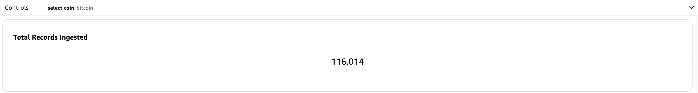

### Panel 2 — Price Trend by Coin
Average Bitcoin price over the 4-day collection window (Jun 22–25, 2026), showing a decline from ~$65K to ~$60K. Other coins appear flat due to scale — Bitcoin's absolute price dominates the y-axis.

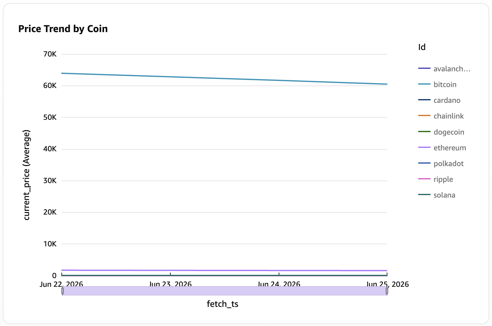

### Panel 3 — Trading Volume by Coin
Total trading volume aggregated across the collection period. Bitcoin leads at ~450T, Ethereum second at ~160T, with a long tail of smaller-cap coins — reflecting real market liquidity distribution.

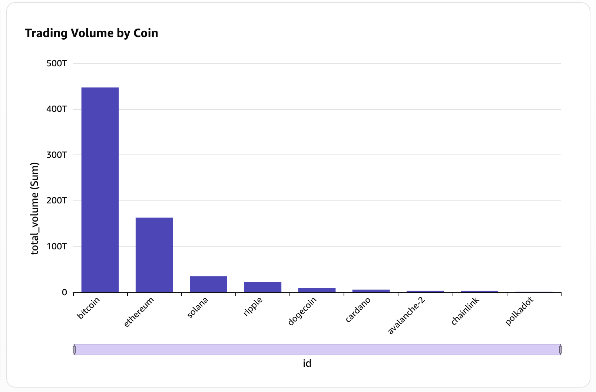

### Panel 4 — Average 24h Price Change by Coin
Coins ranked by average 24h price change percentage across the collection period. Avalanche slightly positive (+0.32%), all others mildly negative (-2% to -3%), reflecting a modest market-wide pullback during the observation window.

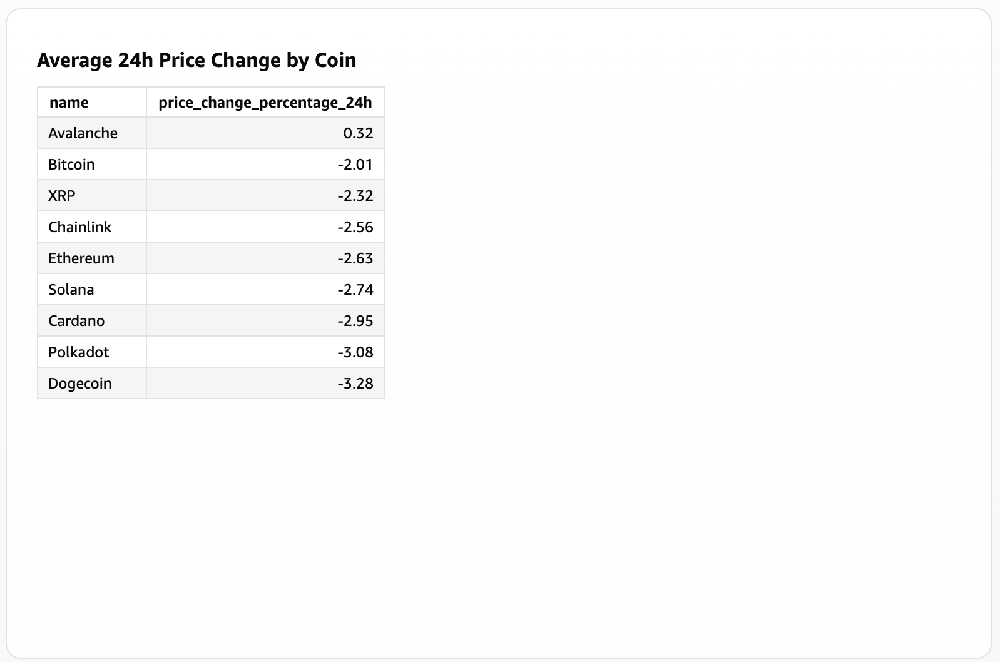

### Panel 5 — 24h Price Change Over Time
All 9 coins tracked simultaneously by 24h price change percentage. A sharp market-wide decline is visible around Jun 23, followed by partial recovery — all coins moving in correlation, consistent with crypto market behavior.

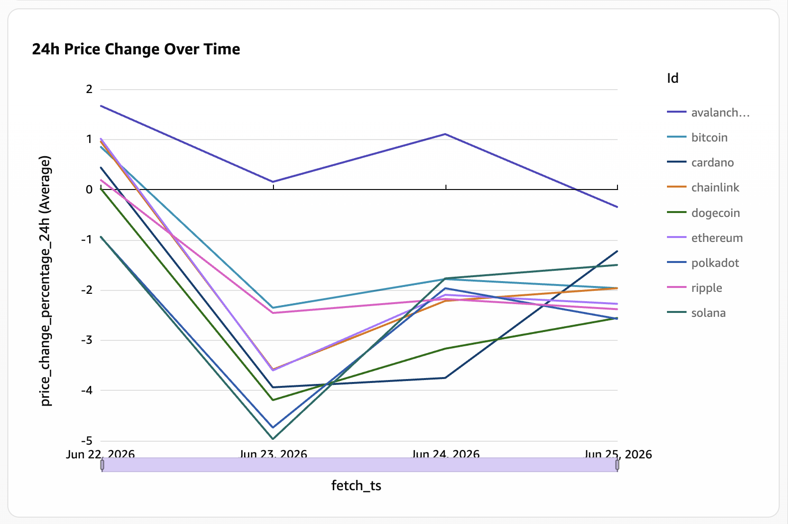

### Panel 6 — 1h Price Change Over Time
Hourly price volatility across all coins over 72 hours. Volatility spikes are visible around Jun 25, with most coins oscillating between -2% and +2% per hour — typical intraday movement for mid-cap crypto assets.

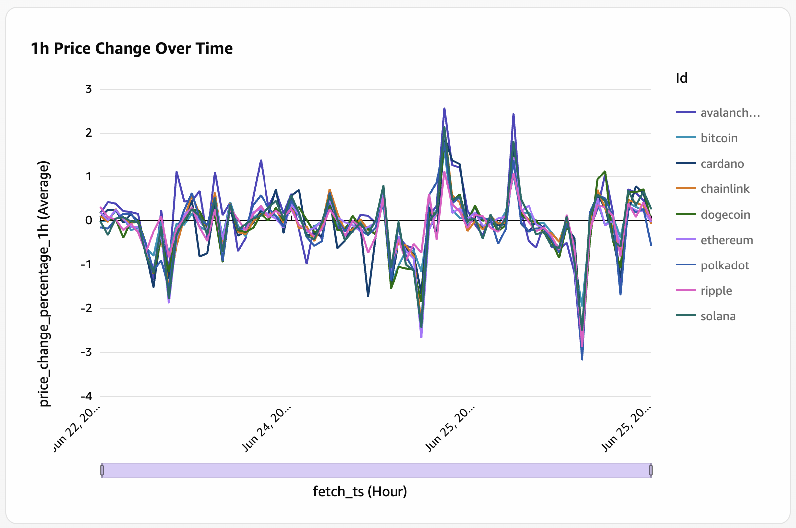

### Panel 7 — 24h High and Low per Coin (Interactive)
Each coin's 24h high and low tracked over the collection period via an interactive dropdown control — select any coin to view its daily trading range over time. For example, Bitcoin shows a consistent ~$3-4K spread between high and low, declining from ~$65K to ~$62K over 4 days. Ethereum shows a similar pattern at a lower price scale (~$1,800 high to ~$1,700 low), with the spread narrowing slightly toward the end of the collection window — reflecting reduced volatility as the market stabilized.

| Bitcoin 24h High and Low | Ethereum 24h High and Low |
|---|---|
| 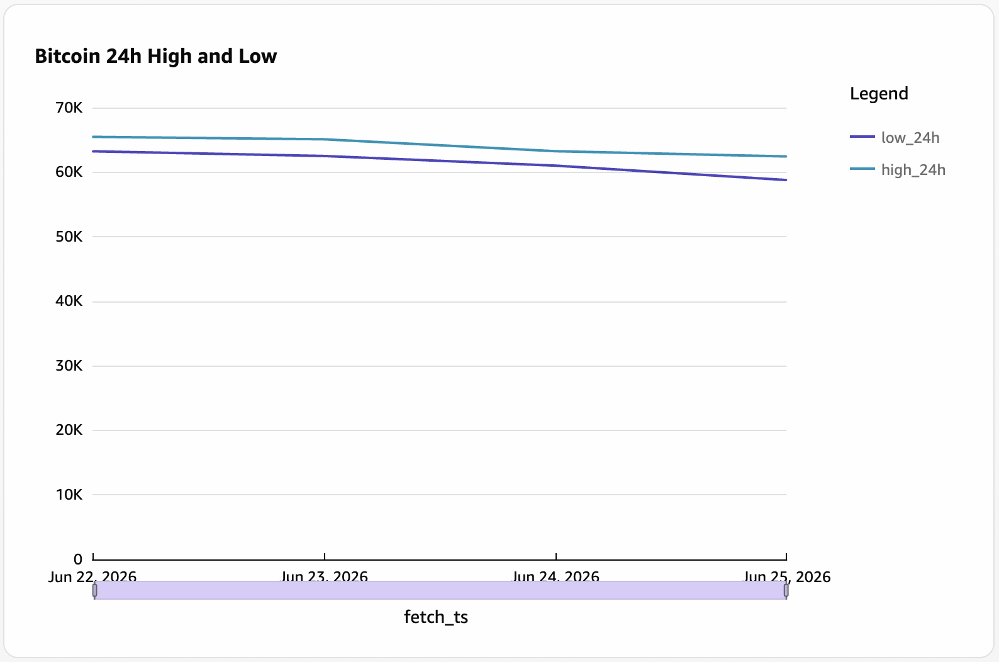 | 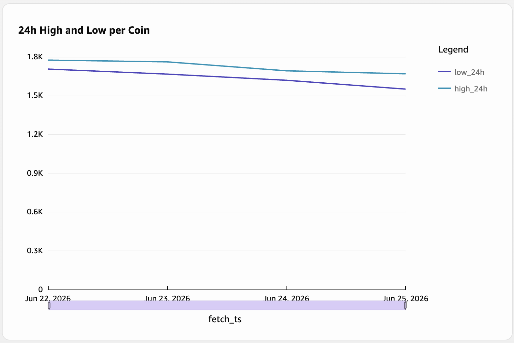 |

### Panel 8 — Records Ingested per Hour (Pipeline Health)
Pipeline throughput held steady at ~1,600 records/hour for 72 consecutive hours, confirming uninterrupted operation of the Kafka → Spark → S3 pipeline running on EC2. The clean drop at the end marks intentional termination of the collection run.

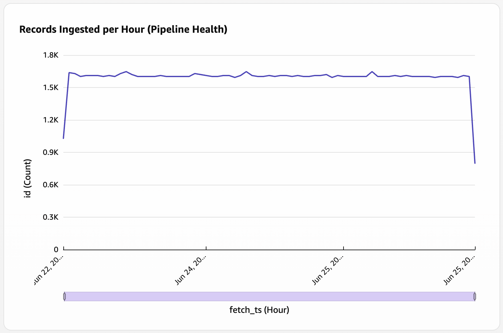

### Panel 9 — Average Market Cap by Coin
Market capitalization ranking across tracked coins. Bitcoin leads at ~$1.3T average, Ethereum at ~$0.2T, with all others negligible by comparison — consistent with real-world crypto market cap distribution during the observation period.

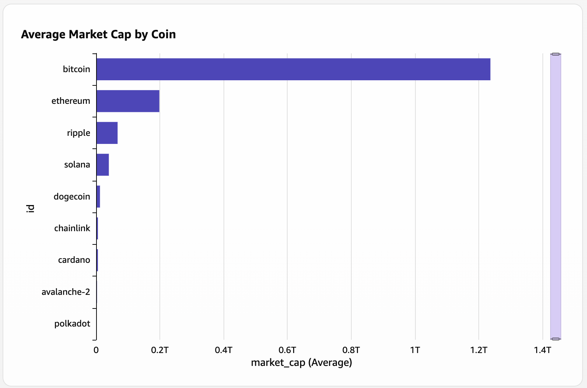

### Panel 10 — Circulating Supply by Coin
Circulating supply ranked by coin. Dogecoin leads with ~1.9T coins in circulation, 
followed by Ripple (~800B) and Cardano (~500B) — contrasting sharply with Bitcoin 
and Ethereum which appear negligible on this scale due to their relatively scarce 
supply (Bitcoin hard-capped at 21M, Ethereum at ~120M). This supply difference 
directly explains why per-coin prices vary so dramatically across assets: scarcity 
drives Bitcoin's $60K price while Dogecoin's abundance keeps it at fractions of a cent.

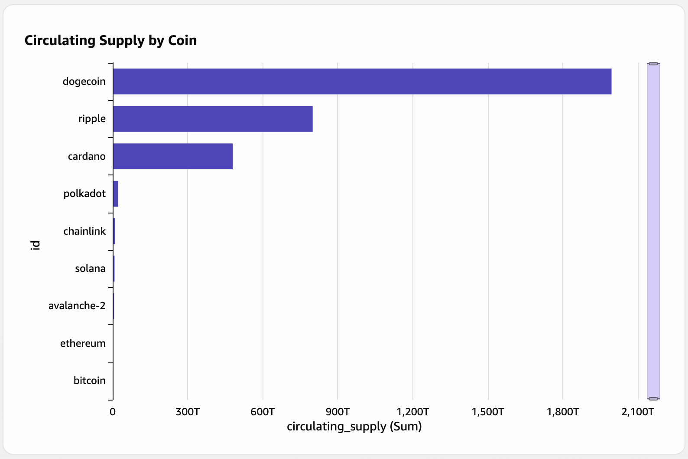

## Athena vs Redshift: Design Tradeoff

| | Athena | Redshift Serverless |
|---|---|---|
| Query model | Serverless, pay-per-query | Always-on (auto-pause), pay-per-RPU-hour |
| Best for | Ad-hoc exploration, infrequent queries | Repeated analytical queries, window functions |
| Schema | Schema-on-read via Glue Catalog | Star schema, DISTKEY + SORTKEY optimized |
| Latency | Seconds to minutes | Sub-second for repeated queries |
| Cost model | $5/TB scanned | $0.36/RPU-hour (pauses when idle) |

Both are used in this pipeline: Athena for exploratory queries on raw S3 data, Redshift for structured analytical queries (LAG, RANK, moving averages) on the star schema.

## Repository Structure

```
├── producer/
│   ├── kafka_producer.py        # Kafka producer, key=coin_id, acks=all
│   └── coingecko_client.py      # CoinGecko API client
├── spark_streaming/
│   ├── streaming_job.py         # Spark Structured Streaming job
│   └── schema.py                # COIN_SCHEMA StructType definition
├── airflow/
│   ├── docker-compose.yml       # Airflow webserver + scheduler + postgres
│   └── dags/
│       └── crypto_pipeline_dag.py  # 4-task DAG with failure callback
├── redshift/
│   ├── schema.sql               # Star schema DDL
│   ├── load_data.sql            # Spectrum-based load
│   └── window_queries.sql       # LAG, RANK, moving average queries
├── docker/
│   └── docker-compose.yml       # Kafka + Zookeeper + Kafdrop
└── config/
    └── .env                     # Environment config (gitignored)
```

## Setup

### Prerequisites
- Docker Desktop
- Python 3.9+
- AWS account with S3, Glue, Athena, Redshift Serverless, CloudWatch configured
- AWS CLI configured with named profile

### Local Development

```bash
# Start Kafka stack
cd docker/
docker compose up -d

# Start Airflow
cd airflow/
docker compose up -d

# Start producer (Terminal 2)
source venv/bin/activate
cd producer/
python kafka_producer.py

# Start Spark streaming job (Terminal 3)
source venv/bin/activate
export AWS_PROFILE=crypto-data-pipeline
cd spark_streaming/
python streaming_job.py
```

### Production Data Collection (EC2)

```bash
# Launch EC2 t3.medium, SSH in, then:
tmux new-session -s pipeline

# Window 0: Producer
python3 kafka_producer.py

# Window 1 (Ctrl+B C): Spark
python3 streaming_job.py

# Detach: Ctrl+B D
# Pipeline runs independently — close SSH safely
```

### Post-Collection Processing

```bash
# Trigger Glue Crawler to catalog new data
aws glue start-crawler --name crypto-clean-crawler --profile crypto-data-pipeline

# Trigger Airflow DAG manually
# Airflow UI → crypto_pipeline_orchestration → Trigger DAG

# Reload Redshift star schema
aws redshift-data execute-statement \
  --workgroup-name crypto-pipeline-workgroup \
  --database crypto_db \
  --sql "$(cat redshift/load_data.sql)"
```